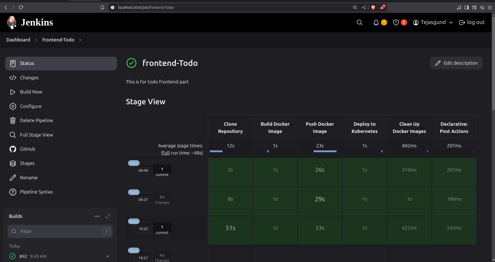
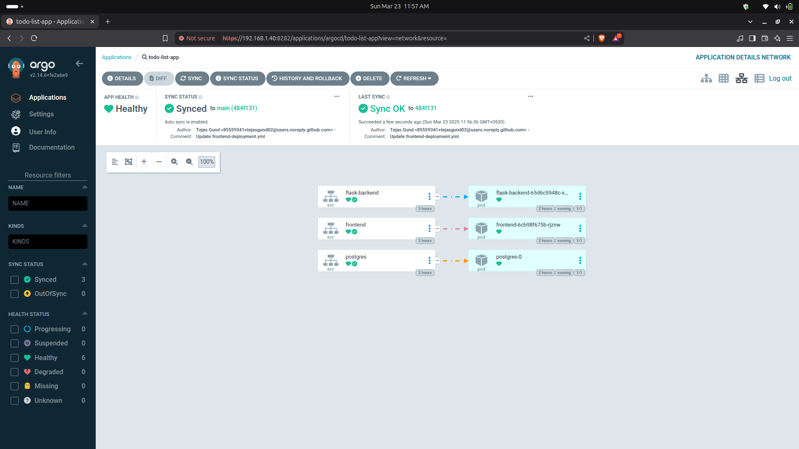

# 📌 3-Tier To-Do List Application

🚀 A containerized To-Do List application deployed on Kubernetes using a **3-tier architecture**: **Frontend (Nginx), Backend (Flask API), and Database (PostgreSQL)**. Managed with **Docker**, **Kubernetes (KIND Cluster)**, **Jenkins CI/CD**, **SonarQube**, **ArgoCD**, and **Prometheus**.

---

## 📜 Architecture Overview

Your system follows a **3-tier architecture**:

1️⃣ **Frontend (Nginx + HTML + JS)**
   - Runs on an Nginx container
   - Serves `index.html`
   - Communicates with the backend via API requests

2️⃣ **Backend (Flask API)**
   - A Flask application inside a Python container
   - Handles CRUD operations
   - Interacts with the PostgreSQL database

3️⃣ **Database (PostgreSQL)**
   - Stores task data
   - Deployed with a Persistent Volume for data persistence

---

## ⚙️ How It Works

📌 **User Workflow**:

1. User interacts with the frontend (`index.html`) via a web browser.
2. JavaScript fetches data from the Flask API (`flask-backend`) using HTTP requests.
3. Flask API processes requests, communicates with PostgreSQL, and responds with JSON data.
4. Tasks are stored in PostgreSQL, allowing users to create, update, or delete them.
5. Kubernetes orchestrates everything, ensuring smooth operation within the KIND cluster.

---

## 📂 Deployment Breakdown

### 🐳 **Docker Images**
✅ **Frontend** → Uses Nginx to serve `index.html`.  
✅ **Backend** → Runs a Flask API inside a Python container.  
✅ **Database** → Uses the official PostgreSQL image.  

### ☸️ **Kubernetes (K8s) Setup**
📌 **Flask Backend Deployment (`flask-deployment.yml`)**  
- Exposes Flask API at port `5000` (NodePort `30000`).

📌 **Frontend Deployment (`frontend-deployment.yml`)**  
- Serves `index.html` and interacts with Flask API.  
- Exposed at port `80` (NodePort `30001`).

📌 **PostgreSQL Deployment (`postgresql-deployment.yml`)**  
- Uses Persistent Volume (`PV/PVC`) for data storage.  
- Communicates with Flask API using service name `postgres`.

📌 **KIND Cluster Configuration (`config.yml`)**  
- Defines control-plane & worker nodes.  
- Maps required ports (`30000`, `30001`).

---

## 🛠️ Setup & Deployment

### 1️⃣ **Clone the Repository**
```bash
git clone https://github.com/SanketNalage/Kubernetes-Hand-on/tree/main/todo-list-main.git
cd todo-app
```

---
## 🚀 CI/CD Pipeline with Jenkins
### Jenkins Setup
***Install Jenkins on your server or local machine.***
Install required plugins:
Docker
Kubernetes
Git
SonarQube Scanner

---

### **Read the Jenkinsfile in Backend and Frontend**

📌 **Backend Jenkinsfile** → Backend CI/CD Pipeline  


📌 **Frontend Jenkinsfile** → Frontend CI/CD Pipeline  

---

## 🚀 **Orchestration with ArgoCD**

ArgoCD is a **declarative, GitOps continuous delivery tool** for Kubernetes. It automates the deployment of applications by syncing the desired state defined in Git repositories with the live state in your Kubernetes cluster. With ArgoCD, you can:

- **Automate Deployments**: Ensure your applications are always in the desired state.
- **Version Control**: Track changes to your Kubernetes manifests in Git.
- **Rollback**: Easily revert to a previous state if something goes wrong.
- **Visualization**: Monitor and manage your deployments via the ArgoCD UI.

ArgoCD is integrated into this project to manage the deployment of the **To-Do List Application** seamlessly.

---

### **How to Use ArgoCD**
1. Install ArgoCD in your Kubernetes cluster.
2. Define your application manifests in a Git repository.
3. Create an ArgoCD application to sync the Git repository with your cluster.
4. Monitor and manage deployments via the ArgoCD UI or CLI.

📌 **ARGOCD:**  



